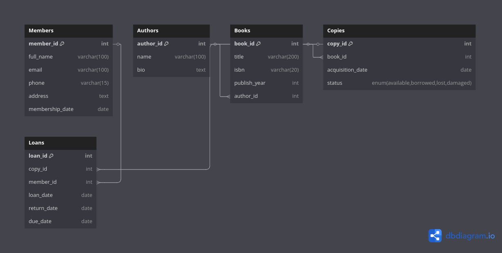

#  Library Management System (MySQL Database)

##  Project Description

This project is a relational database system for managing a library using MySQL. It allows the tracking of members, books, authors, physical copies of books, and loan transactions. The database ensures proper data structure with constraints and relationships between entities.

##  Features

- Store and manage library members and their details
- Maintain records of authors and their books
- Track physical copies of books including their status (available, borrowed, etc.)
- Handle book loans with due dates and return tracking

##  How to Set Up

1. Clone the repository or download the `library_management.sql` file.
2. Open MySQL Workbench or any SQL client.
3. Create a new database (e.g., `library_db`).
4. Run the contents of `library_management.sql` to create all tables.

```
CREATE DATABASE library_db;
USE library_db;
-- then run the script
```

## ERD (Entity Relationship Diagram)

###  View Online
[Click here to view the ERD](https://dbdiagram.io/d/682319a35b2fc4582f5ea99d)

### Screenshot



---

##  File Structure

- `library_management.sql` – SQL file with all table definitions and constraints
- `README.md` – Project overview and setup instructions


---

**Ready to import, explore, and expand!**
